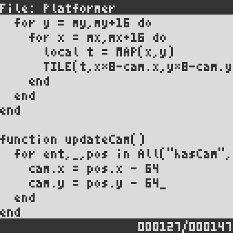

# Using the Code Editor

**NOTE**: _To open the Code Editor from the Terminal, type `EDIT filename` (where `filename` is the name of the file you want to edit) followed by pressing return._

## Controls

* Use the keyboard to type code.

* Use the arrow keys to move the caret up/down/left/right.

* Use the _home_ key to go to the beginning of the current line.

    * Pressing it repeatedly toggles between the position before the first
      non-space character, and the actual first character (space or non-space).

* Use the _end_ key to go to the end of the current line.

* Use _ctrl_ + _home_ key to go to the start of the first line.

* Use _ctrl_ + _end_ key to go to the end of the last line.

* Use _ctrl_ + _F_ key to toggle "search mode".

    * In search mode, type your search term and press _return_ to find the first/next occurrence of the term.
    Pressing _return_ repeatedly cycles through all occurrences. 

    * Use _backspace_ to delete characters at the end of the search term.

* Use _ctrl_ + _G_ to toggle "goto mode".

    * In goto mode, type the line number you want to go to and press _enter_.

* Use _ctrl_ + _D_ to duplicate the current line.

* Use _ctrl_ + _up_ to move the current line up (i.e. swap it with the line above).

* Use _ctrl_ + _down_ to move the current line down (i.e. swap it with the line below).

* Use _ctrl_ + _E_ to run the file in "Game Mode".

* Use _escape_ to exit to the terminal.
