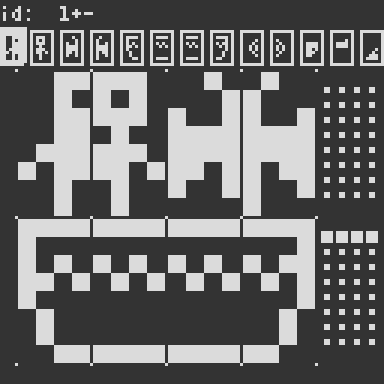

# Using the Image Editor

**NOTE**: _To open the Image Editor from the Terminal, type `IMAGE` followed by pressing return._

The image editor consists of three parts:

* The top area shows the current sprite, along with 12 other sprites with nearby ids.
By clicking on these icons, you can change the currently selected sprite.
The currently selected sprite can also be changed by any of the following three methods:
    * By pressing the '+' or '-' buttons next to the id field.
    * By scrolling the mouse wheel up/down.
    * By pressing the left/right arrowkeys. 
These three methods allows you to access all 255 available sprite slots from the image editor.

* The lower left area is the sprite editor. This area is shows the currently selected sprite, along with the next seven sprites.

    > NOTE: In ECoS, a 4x8 image is called a _sprite_, an 8x8 image is called a _tile_, and a 16x16 image is called a _slab_.
    > Thus, the first (upper-left) editable 4x8 image is the currently 
    > selected sprite, the first two editable 4x8 images (forming an 8x8 
    > image), is the currently selected tile, and all eight 4x8 editable 
    > images (forming a 16x16 image) is the currently selected slab. 

    Editing the sprites is done using the mouse. Holding the left mouse 
    button changes the pixel at the mouse to white, holding the right mouse 
    button changes the pixel to black.

* The lower right area shows the bitflags for the eight sprites shown to its left.
These bits can be set/unset by clicking on them, which toggles their state.

Use _escape_ to exit to the terminal.
