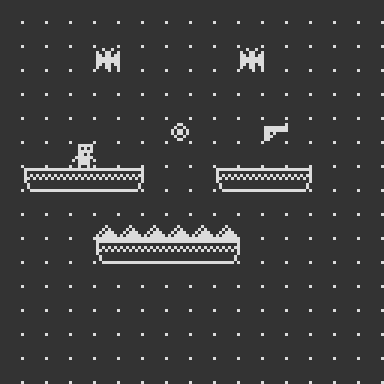

# Using the Level Editor

**NOTE**: _To open the Level Editor from the Terminal, type `LEVEL` followed by pressing return._

The level editor allows you to edit the 128x32 tile level.

## Controls

* Use the left mouse button to place the current tile at the mouse.

* Use the right mouse button to remove the tile at mouse.

* Hold the _ctrl_ key to show the top menu:

    * In this menu you can see the current tile,  along with the tile 
    coordinates of the upper left tile. The "+" and "-" buttons can be used 
    to change the currently selected tile.

* Use the arrow keys or the vertical/horizontal mouse wheel to move around the map. 
    * Holding _shift_ while using the mouse wheel will swap horizontal and vertical scrolling, allowing a single mouse wheel to be used to scroll along both axes.

* Use the _escape_ key to exit to the terminal.
