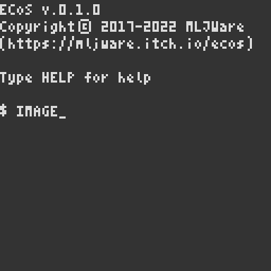
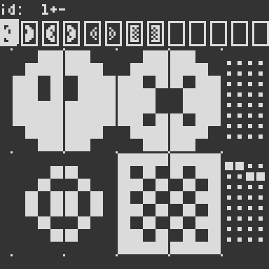
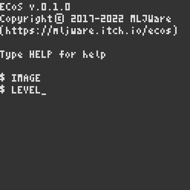
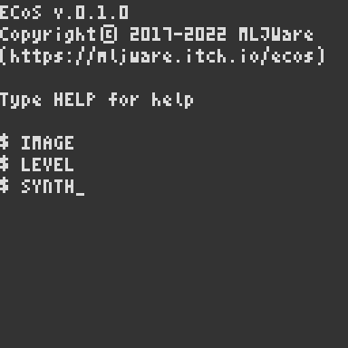
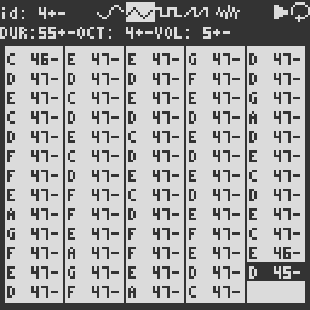
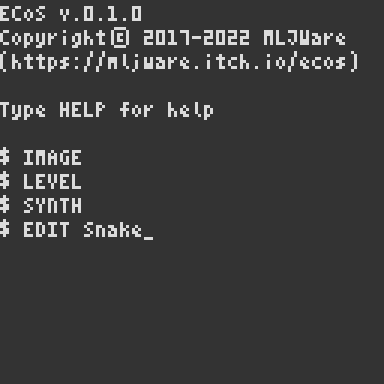

# Tutorial: Snake

This tutorial will guide you through the creation of a simple Snake-style game with ECoS.

<!--   -->

## Making the Graphics

We'll start by making the graphics using the build in Image Editor. 
To open this, type the command `IMAGE` in the Terminal and press _enter_.



(For information on how to use the Image Editor, see [Using the Image Editor](../Using-the-Image-Editor.html).)

For the game we're going to make, we'll be needing 4 images:
1. The head of the snake.
2. A single segment of the body of the snake.
3. An icon for the collectable item. Throughout this tutorial, we'll be referring to this item as the "apple".
4. A solid wall that the snake cannot move through.

How you want these images to look is up to you, but for the sake of this tutorial, they'll each need to be a single tile (i.e. two sprites wide). 

We're going to make use of flags later on when we get to writing the code, so we might as well configure them now. 

> **Flags**:  
> Each sprite has an associated 8 bit flags that can be toggled on/off via the Image Editor. 
> These flags have no special functionality on their own, but can be useful to encode custom information on a per-game basis. 

For the game we'll be making, we're going to need two different flags:
1. A flag to indicate that something is a collectable, which we'll use for the apple.
2. A flag to indicate that something is a solid obstacle, which we'll use for the wall tile.

The image below shows the sprites used in this tutorial, along with the configured flags.  


Press _escape_ to return to the Terminal.


## Making the Level

Now that we have the graphics, it's time to set up the level using the Level Editor. 
To open this, type the command `LEVEL` in the Terminal and press _enter_.



(For information on how to use the Level Editor, see [Using the Level Editor](../Using-the-Level-Editor.html).)

The level we'll be making in this tutorial is rather simple; all we technically need is a border around the edge of the display. 
However, to make things a bit more interesting we're going to make it so that if the snake reaches the end of the screen it'll re-appear from the opposite side. 
For this reason we'll want some gabs in this border.

It should be noted that we won't be using the first row, as this will be used to display the current score. Therefore, the border should start at the second row. 
Also, to keep the code for this tutorial simple, the way we're going to spawn the apple when it's been eating won't work if we place any walls anywhere except for around the border.

The image below shows the level used in this tutorial.  


Press _escape_ to return to the Terminal.


## Making the Sound Effects and Background Music

With the graphics and level in place, the last thing we'll make before we write the code is the sound effects and background music, which we'll make using the Synthesizer/Music Tracker. 
To open this, type the command `SYNTH` in the Terminal and press _enter_.



(For information on how to use the Synthesizer/Music Tracker, see [Using the Synthesizer/Music Tracker](../Using-the-Synthesizer_Music-Tracker.html).)

We're going to need three sound effects, as well as a simple melody to loop in the background:

1. The sound effect used when moving.  


2. The sound effect used when an apple is eaten.  


3. The sound effect used on game over.  


4. The melody playing in the background.  


Press _escape_ to return to the Terminal.


## Writing the Game Code

With everything else prepared, we're finally ready to write the code for our game using the build in Code Editor. To open this, type the command `EDIT Snake` in the Terminal and press _enter_.



(For information on how to use the Code Editor, see [Using the Code Editor](../Using-the-Code-Editor.html).)

ECoS has a powerful Entity-Component-System architecture at its core. 
This tutorial won't go into the details on this architecture, but the overall idea is that it splits all game code up into three overall concepts; _entities_, _components_, and _systems_. 

An **entity** is the simplest of the concepts. Entities are essentially just collections of components that together represents a single "object" or "thing" in the game, such as the player character, or an enemy unit.

A **component** is essentially just some data. Components can either be single primitive values, such as a number or a string, or a Lua table containing closely related values representing a single "concept"/"property" of an entity. Examples of components could be the position of an entity, what sprite should be used to render it, how much health the entity has, etc. 

A **system** is used to define the game logic and/or render graphics. In ECoS, a system is represented as a regular Lua function, that has been _registered_ via one of the special system registration functions.
Three different kinds of systems exist: 

* **Setup systems**, which will be executed once at the beginning of the game. 
  These systems can be useful to set up the initial state of the game, such as creating the initial entities. 
  The special function [`SETUP( fn )`](../api/level-api/Level-Functions.html#setup-fn1) is used to register a setup system (where `fn` is the function to register).

* **Update systems**, which will be executed once each frame. These systems are where the game logic occurs. 
  The special function [`UPDATE( fn )`](../api/level-api/Level-Functions.html#update-fn1) is used to register an update system (where `fn` is the function to register).

    > Note: It's common to split separate concepts into separate systems, such as a system to deal with moving the player entity, a separate system for handling collisions, etc.

* **Render systems**, which will be executed once each frame, after the update systems have been executed. 
  These systems are where all the code related to drawing the content of the game should occur. 
  The special function [`DRAW( fn )`](../api/level-api/Level-Functions.html#draw-fn1) is used to register a render system (where `fn` is the function to register).

### Creating the Setup System

We'll start by defining an _entity template_, `T_BODY`, to represent a single segment of the snake's body. 
```lua
-- Template for a single segment
-- of the snake's body/tail
local T_BODY = {
  img = 3,
  pos = {x=8, y=8},
  target = {x=8, y=8},
} 
```
Each segment of the snake is going to be its own entity, so we'll use this template when creating new entities. That way, whenever we want to make the snake grow, all we need to do is create a new instance of this template and make it follow the snake. 

Our `T_BODY` template consists of three components: 

1. An `img` component which stores the tile id we'll use to draw the body part with.

2. A `pos` component which stores the position of the body part (in tile coordinates).

3. A `target` component which is going to store the position that the body part should move to when the snake moves.

Below the template we'll define a few variables we'll be needing throughout the code.
```lua
local tick,score,isDead
local body,tail
```
Each of these will be used as follows:

* `tick` will be used as a timer to limit how often the snake should move.

* `score` will be used to store the players current score.

* `isDead` will be used to keep track of whether the snake has died. 
  We'll use this to stop the game loop and display a "Game Over" message.

* `body` will be used to store a list of all the segments of the snake's body. 
  We'll use this list in our update system to check whether the snake's head has collided with it's body.

* `tail` will be used to hold a reference to the tail (i.e. last segment) of the snakes body. 
  We'll be needing this reference each time we grow the snake, to set up the new segment.

1. After the variables we have the following function:
    ```lua
    -- Grows the snake by one
    -- additional segment
    function Grow()
      local part = NEW(T_BODY)
      part.pos.x = tail.pos.x
      part.pos.y = tail.pos.y
      part.prev = tail
      tail = part
      body[#body+1] = part.pos
    end
    ```
    This function will be used to grow the snake, by appending a new segment to the end of the snakes body. 

    1. First, we use the [`NEW`](../api/level-api/Level-Functions.html#new-template) function to create a new entity based on our `T_BODY` template.

    2. Next, we set the position of the segment to the position of the snake's current tail.

    3. After this, we add a new component `prev` to the entity, which is going to be a reference to the previous tail of the snake. This will allow us to easily get the position of that segment when we want to move the snake, greatly simplifying the movement code. 

    4. Finally we make sure to update `tail` to the new segment, and add it to our `body` list.

Following this function we have the start of our setup system. 
```lua
-- SETUP is used to register a
-- function that should only run
-- once when the game starts
SETUP(function ()
  score = 0
  body = {}
  tail = NEW{
    pos = {x=8, y=8},
    dir = {x=0,y=0},
    img = 1,
  }
...
```
Here, we're setting up the initial values of our variables. 
Note how the [`NEW`](../api/level-api/Level-Functions.html#new-template) function is used to create a new entity with a `pos`, `dir` and `img` component. This entity is going to represent the head of the snake. Unlike the rest of the snake, this entity doesn't have a `target` component; instead it has a `dir` component which we'll use to keep track of which direction the snake is currently moving.

We want the snake to have a small body from the beginning, so that it doesn't start out as a disembodied head. Luckily, all we need to do to give it a body is to call our `Grow` function a couple of times, to add a few segments to the body.

```lua
...
  Grow()
  Grow()
...
```

The last thing we need to do in out setup system is to spawn the apple, and start the background music.
```lua
...
  local x,y = RND(1,14), RND(2,14)
  if x == 8 and y == 8 then x = 2 end
  MAP(x,y, 5)
  SNDL(4)
end)
```
1. We start by picking a random `x` and `y` position. For the x-coordinate we'll pick a random number between 1 and 14 (since the entire screen is 16 tiles wide and we don't want to spawn the apple on the border). Similarly, for the y-coordinate we'll pick a random number between 2 and 14 (since the entire screen is 16 tiles tall and we don't want to spawn the apple on the border, nor should it spawn inside the part of the screen where we show the score).
2. Our snake starts out at position `{x = 8, y = 8}`, so to make sure we don't spawn the apple directly inside the snake's head, we check to see if the randomly picked tile position is equal to this, in which case we move it to a different spot.
3. Once we have the random position for the apple, we use the [`MAP`](../api/level-api/Level-Functions.html#map-x-y) function to override the tile at that location in the level with our apple tile (id `5`).
4. Finally, we use [`SNDL`](../api/Sound-API.html#sndl-id) to start our background music (id `4`) playing in a loop.

### Processing Input

Before we write the actual update system, we'll define the functions we're going to be using within it. Several of these functions could technically be defined as their own update systems, but to be able to easily disable them when the snake dies, we'll instead be calling them from within a single update system.

The first function we'll define is going to handle the user input.
```lua
-- Handles key input
function ProcessInput()
  for _, dir in ALL("dir") do
        if KEY"U" and dir.y ~=  1 then dir.x =  0 dir.y = -1 tick = tick or -1
    elseif KEY"D" and dir.y ~= -1 then dir.x =  0 dir.y =  1 tick = tick or -1
    elseif KEY"L" and dir.x ~=  1 then dir.x = -1 dir.y =  0 tick = tick or -1
    elseif KEY"R" and dir.x ~= -1 then dir.x =  1 dir.y =  0 tick = tick or -1 end
  end
end
```
Here we're using the [`ALL`](../api/level-api/Level-Functions.html#all-class-) function to iterate through all entities with a `dir` component, using the [`KEY`](../api/Input-API.html#key-key) function to check which direction the player is pressing and updating the `dir` accordingly. We also make sure to initialize `tick` to `-1` if it wasn't already initialized. Doing so will allow us to wait for the first button to be pressed before we start running out `tick` counter.


> You might be wondering why we're using a for-loop to achieve what is essentially just updating the `dir` component on the head of the snake, when we could have just kept a direct reference to it instead. Indeed, either approach would work just fine in this case, however, there are some advantages to doing it this way instead: 
> * When using a direct reference, the reference has to always remain valid. With the way we're going to write the code in this tutorial this wouldn't a problem, but for more complex games, it can sometimes be hard to ensure that a reference to an entity is always valid. 
> * Using the `ALL` function decouples the behavior from any single entity, making it much easier to later change the game to have more than one snake. 
> In fact, in most Entity-Component-Systems, the behavior of the `ALL` function is an integrated part of how the systems work, in the sense that you'd register a system based on what components it requires, with the system itself being a function that takes an entity and the requested components as argument.

### Changing to the Game Over State

We're going to need a easy way to enable the "Game Over" state. For this, we'll make a function, `GameOver`. 

```lua
-- Called when the snake hits
-- its tail to end the game
function GameOver()
  isDead = true
  SND(-1)
  SND(3)
end
```
This function does three simple things: 
1. It sets our `isDead` variable to `true`, to indicate that we're in the "Game Over" state.
2. It stops all sounds and music from playing, using [`SND(-1)`](../api/Sound-API.md#snd--1).
3. It plays the death sound effect (id `3`) once, using [`SND`](../api/Sound-API.md#snd-id).

### Moving the Apple

Another feature we're going to need is the ability to move the apple once it's been eaten. 
For this, we'll write the following function, which sets the tile at the specified position to id `0` and changes a random tile within the border to the apple tile (id `5`).

```lua
-- Changes the position of the
-- "apple" to a random location
function MoveApple(x,y)
  MAP(x, y, 0)
  MAP(RND(1,14), RND(2,14), 5)
end
```

### Moving the Snake's Body

The next function we'll define is going to be in charge of moving the snake's body.
```lua
-- moves the segments of the
-- snakes body
function MoveBodyParts()
  for _, prev, target
  in ALL("prev", "target") do
    target.x = prev.pos.x
    target.y = prev.pos.y
  end
  for _, pos, target 
  in ALL("pos", "target") do
    pos.x = target.x
    pos.y = target.y
  end
end
```

The function works in two steps:
1. First, it iterates through all entities with a `prev` and `target` component (which corresponds with each of the snake's body segments), and updates the coordinates of the `target` component to that of the previous segments position. 
2. Next, it iterates through all entities with a `pos` and `target` component (which, again, corresponds with each of the snake's body segments), and updates the position to that of the now updated target position.

This way, each segment's position will have updated to the previous position of the segment before it, giving us the snake-like movment behavior we're interested in.

### Moving the Snake's Head

Moving the snake's head is a bit more involved than simply changing it's position; we also need to have the case where it wraps to the opposite site of the screen, as well as handle the cases where the snake moves into an apple or a wall.

We start by iterating over all entities with a `pos` and `dir` component (of which there'll only only be a single entity, namely the snake's head). 
```lua
-- moves the head of the snake
function MoveHead()
  for _, pos, dir
  in ALL("pos", "dir") do
...
```
Next, we'll use [`SND`](../api/Sound-API.html#snd-id) to play our movement sound effect (id `1`) .
```lua
...
    SND(1)
...
```
After this we'll handle the actual movement of the head, including the wrapping at the screen edges. 
```lua
...
    local x,y
    x = OVFW(pos.x + dir.x, 0,15)
    y = OVFW(pos.y + dir.y, 1,15)
    pos.x = x
    pos.y = y
...
```
Here, we're using the [`OVFW`](../api/math-api/General-Math-Functions.html#ovfw-n-min-max) function to handle the wrapping and update the position of the head. Note that we're also storing the coordinates of the new position in the local variables `x` and `y` for use throughout the rest of the function.

After this we'll write the code that'll handle colliding with an apple or a wall tile.
```lua
...
    -- check whether the head
    -- is on top of an apple
    -- or inside a wall
    local tile = MAP(x,y)
    if FLG(tile,0x01) then
      SND(2)
      score = score + 100
      MoveApple(x,y)
      Grow()
    elseif FLG(tile, 0x02) then
      GameOver()
    end
...
```
Here, we're using the [`MAP`](../api/level-api/Level-Functions.html#map-x-y) function to retrieve the id of the tile below the head. 
We then use the [`FLG`](../api/level-api/Level-Functions.html#flg-id-mask) function to check whether the tile is an apple (indicated by bit flag 1). 
If it is, we then;
* play the eating sound effect (id `2`), using the [`SND`](../api/Sound-API.html#snd-id) function,
* increase the score by `100` points,
* move the apple to a new random location, using our `MoveApple` function, and
* make the snake grow by another segment, using our `Grow` function.

Otherwise, if the tile was not an apple, we check to see if it's a wall tile (indicated by bit flag 2), and if so, we call our `GameOver` function to end the game loop.

The last part of our function will be concerned with testing whether the snake has collided with itself.
```lua
...
    -- check whether the head
    -- overlaps part of the body
    for _,part in ITER(body) do
      if pos.x == part.x
      and pos.y == part.y then
        GameOver()
      end
    end
  end
end
```
Here, we iterate through each of the segments in out `body` list, using the [`ITER`](../api/Utility-Functions.md#iter-t) utility function, to see if the position corresponds to that of the head; if so, we use our `GameOver` function to end the game loop.

### Creating the Update System

With all the helper functions already defined, writing the actual update system is rather straight forward.

First we check to make sure the snake has died; if so, we''ll simply return from the update system, as we don't want any logic to run in this case.
```lua
-- UPDATE is used to register
-- a function that should be
-- called once each frame to
-- update the game logic
UPDATE(function ()
  -- don't update logic if the
  -- snake is dead
  if isDead then return end
...
```
Next, we'll use our `ProcessInput` function to handle the players input and update the direction of the head.
```lua
...
  ProcessInput()
...
```
After this, we'll check to see if `tick` has been initialized (meaning that the snake should be moving), and if so we'll update it. We're going to have it loop over each time it's counted to 15, which will result in the snake moving 4 times per second.
```lua
...
  if not tick then return end
  tick = (tick + 1) % 15
  if tick > 0 then return end
...
```

Finally, if the `tick` is equal to `0`, we call our movement functions to move the body and head of the snake.
```lua
...
  MoveBodyParts()
  MoveHead()
end)
```

### Creating the Render System

The last system we need to create is our render system. This system will consist of four parts; drawing the tiles in the level, drawing the entities, printing the score, and showing a "Game Over" message when the snake has died.

We'll start by iterating through the visible tiles using a nested for-loop. In it, we'll use the [`Map`](../api/level-api/Level-Functions.html#map-x-y) function to get the tile, which we can then draw using the [`TILE`](../api/Graphics-API.html#tile-id-x-y) function.
```lua
-- DRAW is used to register a
-- a function that should be
-- called each time the virtual
-- display is redrawn
DRAW(function ()
  -- draws the background tiles
  for y=0,15 do
    for x=0,15 do
      TILE(MAP(x,y), x*8,y*8)
    end
  end
...
```
Next, we'll iterate through all entities with a `"pos"` and `"img"` component using the [`ALL`](../api/level-api/Level-Functions.html#all-class) function, and draw them with the [`TILE`](../api/Graphics-API.html#tile-id-x-y) function.

```lua
...
  -- draws all entities
  for _, pos, img
  in ALL("pos", "img") do
    TILE(img, pos.x*8, pos.y*8)
  end
...
```

Next we'll use the [`TXT`](../api/Graphics-API.html#txt-str-x-y-clear) function to print the current score at the top of the screen.

```lua
...
  -- prints the current score
  TXT("Score "..score, 0,0, true)
...
```

Finally, we'll check to see if the player has died; if so, we'll use the [`TXT`](../api/Graphics-API.html#txt-str-x-y-clear) function to show a simple "Game Over" message.

```lua
...
  -- shows death message if dead
  if isDead then
    TXT("  GAME OVER  ", 38,60, true)
  end
end)
```

